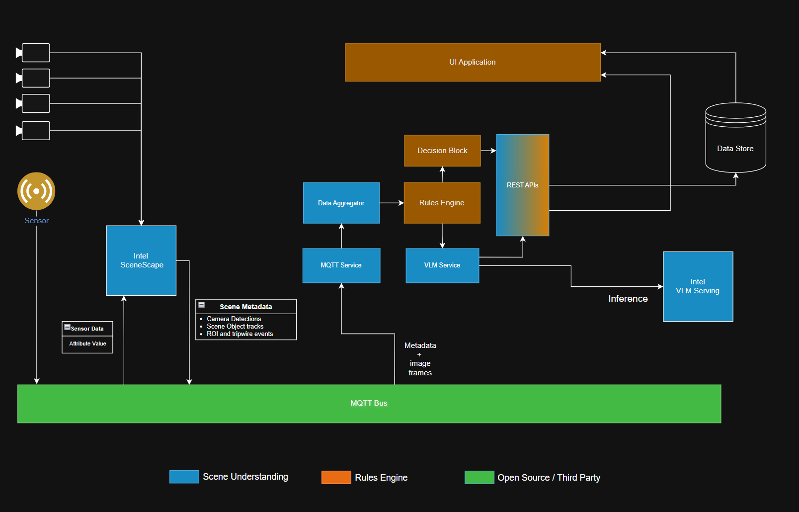

# Retail Store Agent

A retail analytics agent that integrates with Scenescape for real-time store monitoring and VLM-based analysis.

## Architecture

This agent connects to an existing Scenescape deployment running in the same Docker network. It:
- Subscribes to MQTT camera data from Scenescape
- Aggregates data from multiple retail store cameras
- Feeds data to a Vision Language Model (VLM) for analysis
- Provides REST API endpoints for querying retail insights

### Architecture Diagram


*Figure 1: Detailed Architecture of the Scene Understanding and Rules Engine*

## Key Components

- **MQTT Service**: Subscribes to camera data/image, scene data and event topics from Scenescape
- **Data Aggregator**: Collects and prepares data for analysis
- **VLM Service**: Structures the prompt and sends data to Vision Language Model for intelligent analysis
- **API Routes**: RESTful endpoints to access retail analytics
- **Config Service**: configuration management

## Configuration

Configuration is stored in `src/config/retail_store_agent.json`:

```json
{
  "store": {
    "name": "retail_store_1",
    "id": "store_001"
  },
  "mqtt": {
    "host": "broker.scenescape.intel.com",
    "port": 1883,
    "num_cameras": 4,
    "data_topic_prefix": "scenescape/data/camera/camera",
    "image_topic_prefix": "scenescape/image/camera/camera",
    "rate_limit_seconds": 10.0
  },
  "vlm": {
    "base_url": "http://vlm-openvino-serving:8000",
    "model": "Qwen/Qwen2.5-VL-3B-Instruct",
    "timeout_seconds": 300,
    "max_completion_tokens": 1500,
    "temperature": 0.1,
    "top_p": 0.1
  },
  "analysis": {
    "analysis_window_seconds": 30
  }
}
```

## Setup

### Prerequisites

Scenescape must be running in the same Docker network

### Quick Start

```bash
# Set environment variables (optional)
source setup.sh --setenv

# Build and start the agent
source setup.sh --setup

# Or start without rebuilding
source setup.sh --run
```

### Environment Variables

You can override config values using environment variables:

```bash
export STORE_NAME="my_store"
export STORE_ID="store_002"
export NUM_CAMERAS=6
export MQTT_HOST="my-mqtt-broker.com"
export MQTT_PORT=1883
export VLM_MODEL_NAME="Qwen/Qwen2.5-VL-3B-Instruct"
export VLM_DEVICE="GPU"  # or CPU
export AGENT_BACKEND_PORT=8081
```

## Usage

### API Endpoints

Once running, access the API documentation at:
```
http://localhost:8081/docs
```

### Main Endpoint

**GET** `/retail/current`

Returns current retail store analysis including:
- Store data and camera information
- VLM analysis summary

## Management Commands

```bash
# Restart the agent
source setup.sh --restart

# Stop the agent
source setup.sh --stop

# Clean up (keeps VLM models)
source setup.sh --clean --keep-models

# Clean up everything
source setup.sh --clean

# Show help
source setup.sh --help
```

## Development

### Project Structure

```
.
├── src/
│   ├── main.py                    # FastAPI application entry point
│   ├── api/
│   │   └── routes.py             # API endpoints
│   ├── services/
│   │   ├── config.py             # Configuration management
│   │   ├── mqtt_service.py       # MQTT client and message handling
│   │   ├── vlm_service.py        # VLM integration
│   │   └── data_aggregator.py   # Data collection and aggregation
│   ├── models/
│   │   ├── retail.py             # Retail data models
│   │   ├── vlm.py                # VLM analysis models
│   │   └── enums.py              # Enumerations
│   └── config/
│       └── retail_store_agent.json
├── docker/
│   └── agent-compose.yaml        # Docker Compose configuration
└── setup.sh                       # Setup script
```

### Adding Custom Rules

The architecture is designed to be extended with custom rules engines. The data flow is:

1. **MQTT Service** receives raw camera data
2. **Data Aggregator** collects and structures the data
3. **Rules Engine** (to be implemented) can process data before VLM
4. **VLM Service** provides AI-based insights
5. **API** exposes the results

You can add custom services in the `services/` directory and integrate them into the data aggregator.

## Troubleshooting

### MQTT Connection Issues

1. Verify Scenescape is running: `docker ps | grep scenescape`
2. Check network: `docker network ls | grep scenescape`
3. Test MQTT broker connectivity
4. Check logs: `docker logs -f <container-name>`

### VLM Service Issues

1. Check GPU/CPU availability
2. Verify model download: models are cached in `ov-models` volume
3. Adjust VLM_DEVICE or VLM_COMPRESSION_WEIGHT_FORMAT

### Performance Optimization

- **GPU acceleration**: Set `VLM_DEVICE=GPU` for faster inference
- **Rate limiting**: Adjust `rate_limit_seconds` in config to control analysis frequency

## License

Copyright (C) 2025 Intel Corporation  
SPDX-License-Identifier: Apache-2.0
